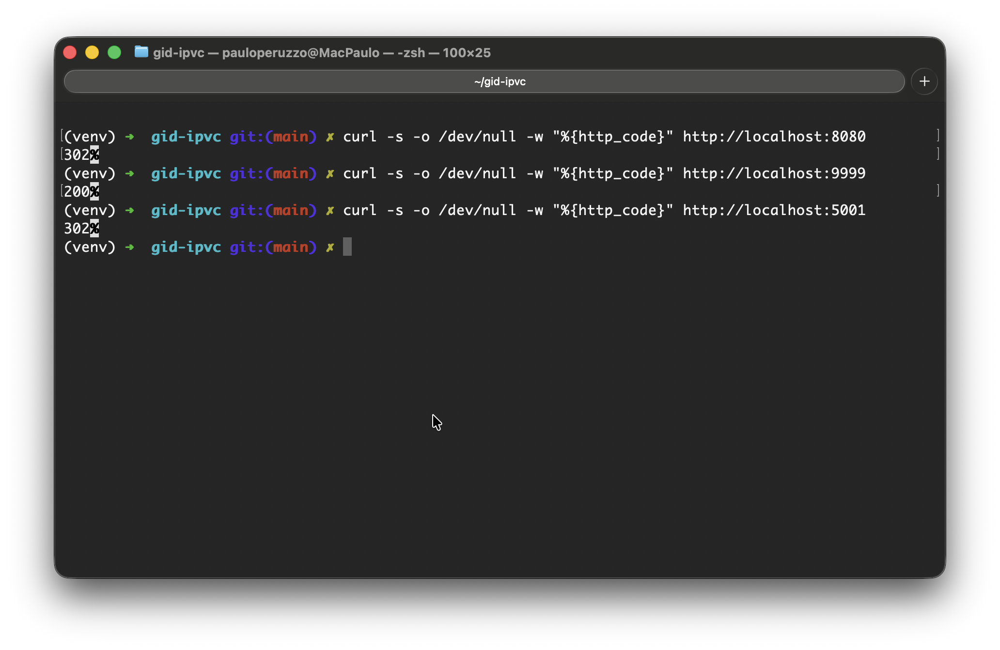
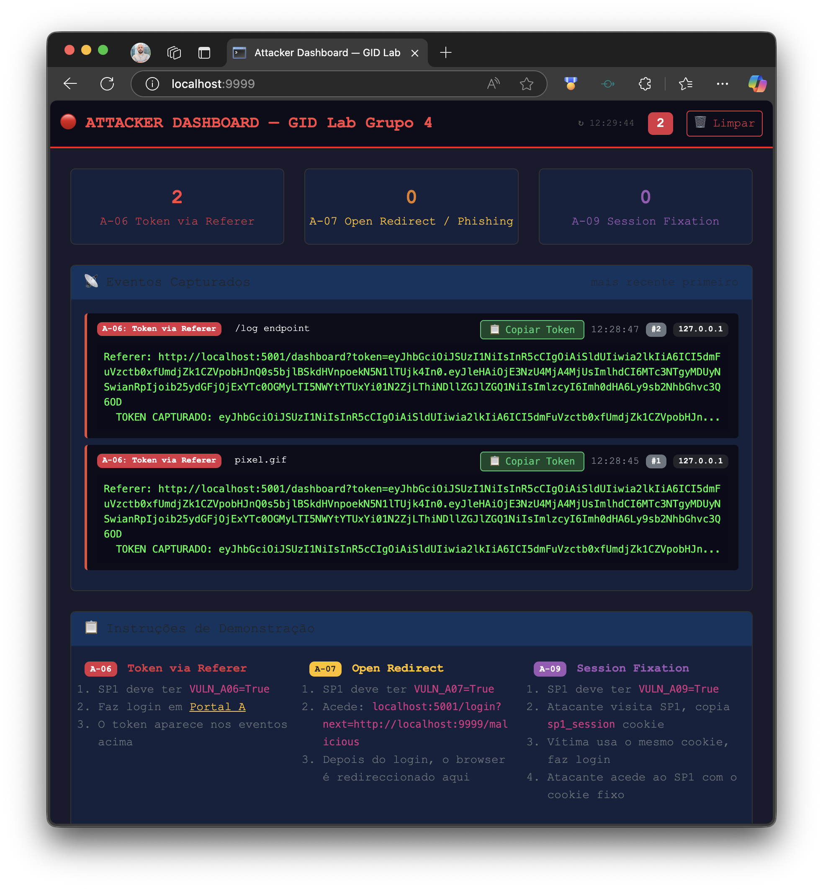
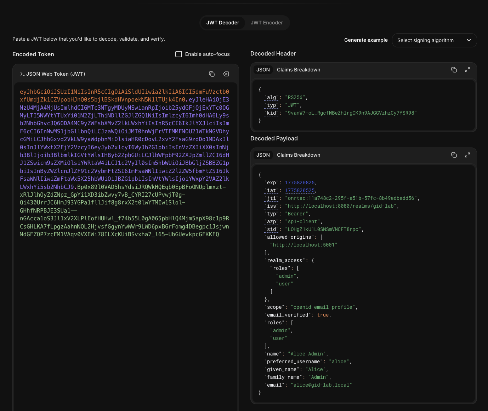
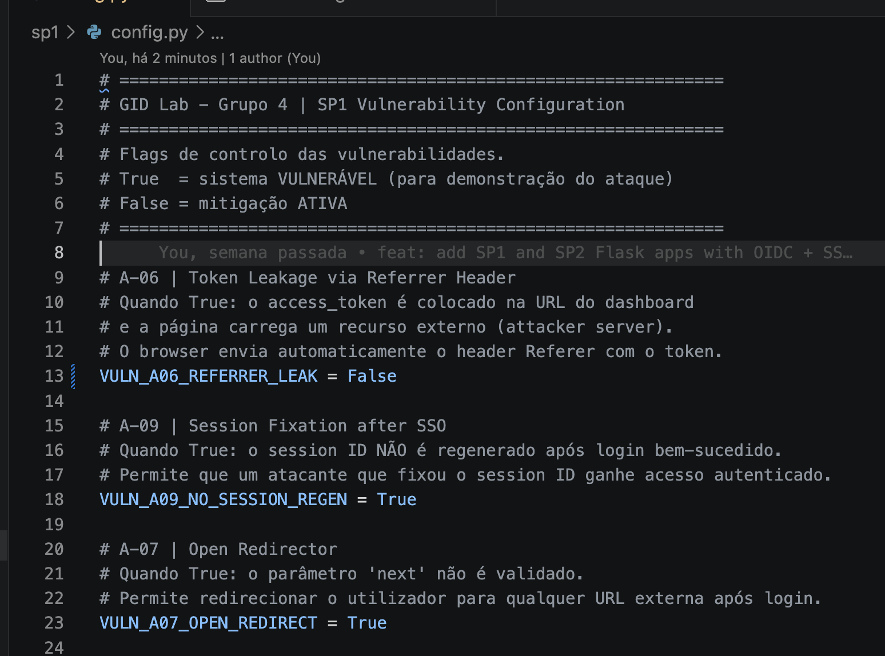
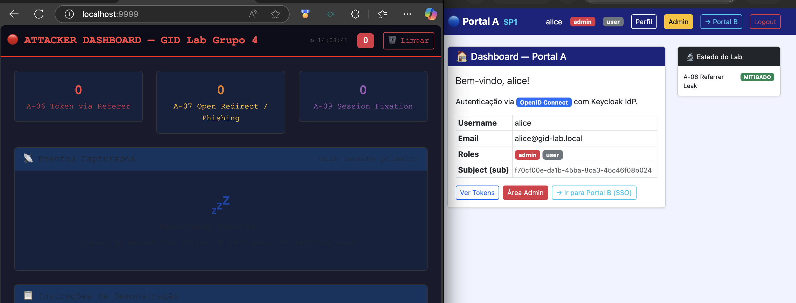

# Logbook — A-06: Token Leakage via Referrer Header

**Grupo:** 4 — Mestrado em Cibersegurança, IPVC  
**Protocolo:** OpenID Connect (OIDC)  
**Stack:** Keycloak (IdP) + Flask SP1 (Service Provider)  
**Data:** 2026-04-10

---

## Ambiente

| Componente | URL | Descrição |
|------------|-----|-----------|
| Keycloak IdP | `http://localhost:8080` | Identity Provider |
| SP1 — Portal A | `http://localhost:5001` | Service Provider vulnerável |
| Attacker Server | `http://localhost:9999` | Servidor do atacante |

---

## Fase 1 — Exploração da Vulnerabilidade

### 1.1 Configuração inicial (modo vulnerável)

Ficheiro `sp1/config.py` com as flags de vulnerabilidade activas:

```python
VULN_A06_REFERRER_LEAK    = True   # token colocado na URL após login
VULN_A09_NO_SESSION_REGEN = True
VULN_A07_OPEN_REDIRECT    = True
```


### 1.2 Arranque dos serviços

Verificação dos 3 serviços via `curl`:

```bash
curl -s -o /dev/null -w "%{http_code}" http://localhost:5001  # → 302 (redirect para /login)
curl -s -o /dev/null -w "%{http_code}" http://localhost:9999  # → 200 (attacker dashboard)
curl -s -o /dev/null -w "%{http_code}" http://localhost:8080  # → 302 (redirect Keycloak admin)
```

| Serviço | Resposta | Estado |
|---------|----------|--------|
| SP1 :5001 | 302 | ✅ Online |
| Attacker :9999 | 200 | ✅ Online |
| Keycloak :8080 | 302 | ✅ Online (redirect esperado) |



### 1.3 Login no Portal A e captura do token

Login com o utilizador `alice` em `http://localhost:5001`.

Após autenticação, o SP1 redireciona para o dashboard com o token na URL:

```
http://localhost:5001/dashboard?token=eyJhbGciOiJSUzI1NiIsInR5cCI6IkpXVCJ9...
```

O access token é exposto como query parameter — visível na barra de endereços,
em logs de servidor, no histórico do browser e nos headers de pedidos subsequentes.



### 1.4 Token capturado no Attacker Dashboard

O Attacker Dashboard em `http://localhost:9999` regista automaticamente 2 eventos
no momento em que o browser da vítima carrega a página do dashboard:

| Evento | Origem | O que acontece |
|--------|--------|----------------|
| `pixel.gif` | `` | Browser carrega a imagem e envia Referer com token |
| `/log endpoint` | `fetch(..., {referrerPolicy: "unsafe-url"})` | Script JS faz pedido e envia Referer com token |

Ambos os pedidos chegam ao atacante com o header:
```
Referer: http://localhost:5001/dashboard?token=eyJhbGci...
```

> **Nota:** o print `a06-03-dashboard-token-url.png` documenta simultaneamente
> o token na URL (passo 1.3) e a captura no Attacker Dashboard (passo 1.4).

### 1.5 Inspecção e utilização do token capturado

O token capturado é um **JWT (JSON Web Token)** composto por 3 partes codificadas
em Base64url: `header.payload.signature`.

#### Método 1 — Decode via jwt.io

O token foi colado em [https://jwt.io](https://jwt.io) para inspecção do conteúdo
sem necessidade de ferramentas de linha de comando.

**Header:**
```json
{
  "alg": "RS256",
  "typ": "JWT",
  "kid": "9vanW7-oL_RgcfMBeZhlrgCK9n9AJGGVzhzCy7YSR98"
}
```

**Payload:**
```json
{
  "exp": 1775820825,
  "iat": 1775820525,
  "jti": "onrtac:11a748c2-295f-a51b-57fc-8b49edbedd56",
  "iss": "http://localhost:8080/realms/gid-lab",
  "typ": "Bearer",
  "azp": "sp1-client",
  "sid": "LOHgZ1kU1L0SNSmVNCFT8rpc",
  "allowed-origins": [
    "http://localhost:5001"
  ],
  "realm_access": {
    "roles": [
      "admin",
      "user"
    ]
  },
  "scope": "openid email profile",
  "email_verified": true,
  "roles": [
    "admin",
    "user"
  ],
  "name": "Alice Admin",
  "preferred_username": "alice",
  "given_name": "Alice",
  "family_name": "Admin",
  "email": "alice@gid-lab.local"
}
```

**Verificação de assinatura (chave pública RSA do Keycloak):**
```json
{
  "e": "AQAB",
  "kty": "RSA",
  "n": "oaW8cAB-b26jjGBi19LLTeI77NiREB9GcEI5GtcfXhJfaP7qN_BmU4xlhfdAuGcabn07LnlvROURRnbC_Hz1V7lhyCkQf5Jm96FgtN5TjjaZ3d-mppBOEqfpCEmnU5fbZa9TNqPFcjBdAj1_-2RUHsJM24KUXehXi6uqZd-2R3Jk1H7kl7o1A5AMx6Ju7FaaKvxHIgkrnuThz--VTlQd9VkDZVsQrfCznr2PJcpdPvgIZtvw_n63_2ELtqEoL8l8gLnOGOw91IZs4tTlw8xgMuSUY2UNXnookRqyteVZCSJ5_52-kVYWtyCaatZRQPUOJdEqTnDtyWm5ZiaElphb-Q"
}
```

Resultado: **✅ Assinatura válida** — o token é autêntico e foi emitido pelo Keycloak do `gid-lab`.

> **Impacto:** O atacante obteve um token válido e assinado com os dados completos
> da alice (nome, email, roles `admin` + `user`) sem interagir com ela ou saber a sua password.

#### Método 2 — Validação via script Python

```bash
python attacks/a06_use_token.py "eyJhbGci..."
```

Chama o endpoint `/userinfo` do Keycloak com o token roubado e devolve
os dados do utilizador — confirmando que o token está activo e é aceite pelo IdP.



---

## Fase 2 — Mitigação

### 2.1 Configuração (modo mitigado)

Flag alterada em `sp1/config.py`:

```python
VULN_A06_REFERRER_LEAK    = False   # ← mitigação activa
VULN_A09_NO_SESSION_REGEN = True
VULN_A07_OPEN_REDIRECT    = True
```

SP1 reiniciado após a alteração.



### 2.2 O que muda no código com `False`

**`/callback` — token não vai para a URL:**

```python
if VULN_A06_REFERRER_LEAK:
    return redirect(url_for("dashboard", token=access_token))
    # ↑ NÃO executado

return redirect(url_for("index"))
# ↑ redireciona para / — token permanece apenas em session["access_token"]
```

**`home.html` — recurso externo não é carregado:**

```html

  <!-- ↑ vuln_a06=False → bloco ignorado → pixel.gif nunca carregado -->

```

**Header `Referrer-Policy: no-referrer` adicionado a todas as respostas:**

```python
@app.after_request
def set_security_headers(response):
    if not VULN_A06_REFERRER_LEAK:
        response.headers["Referrer-Policy"] = "no-referrer"
    return response
```

---

## Fase 3 — Teste de Confirmação

### 3.1 Login após mitigação — URL sem token

Login repetido com `alice` / `alice123` com `VULN_A06_REFERRER_LEAK = False`.

Após autenticação, o SP1 redireciona para:

```
http://localhost:5001/
```

O token **não aparece** na URL — permanece apenas em `session["access_token"]`
no servidor, inacessível ao browser e a qualquer recurso externo.

### 3.2 Attacker Dashboard — sem eventos capturados

Com os dois browsers lado a lado (Portal A à direita, Attacker Dashboard à esquerda):

- **Portal A** — URL limpa, sem `?token=`, dashboard carregado normalmente
- **Attacker Dashboard** — zero eventos capturados após o login

O `pixel.gif` e o `/log endpoint` deixaram de ser carregados pela página,
e o header `Referrer-Policy: no-referrer` impediria a fuga mesmo que fossem.



---

## Resultado

| Fase | Resultado |
|------|-----------|
| Exploração — token na URL | ✅ Token exposto em `?token=eyJ...` |
| Exploração — captura pelo atacante | ✅ Token extraído do header `Referer` |
| Exploração — token válido (jwt.io) | ✅ Dados completos de alice confirmados |
| Mitigação aplicada (`VULN_A06 = False`) | ✅ |
| Confirmação — URL limpa após login | ✅ Sem `?token=` na URL |
| Confirmação — Attacker Dashboard vazio | ✅ Zero eventos capturados |

**Conclusão:** A vulnerabilidade A-06 é completamente mitigada pela combinação de
duas medidas: remover o token da URL (mantê-lo apenas na sessão server-side) e
adicionar o header `Referrer-Policy: no-referrer` às respostas do servidor.
