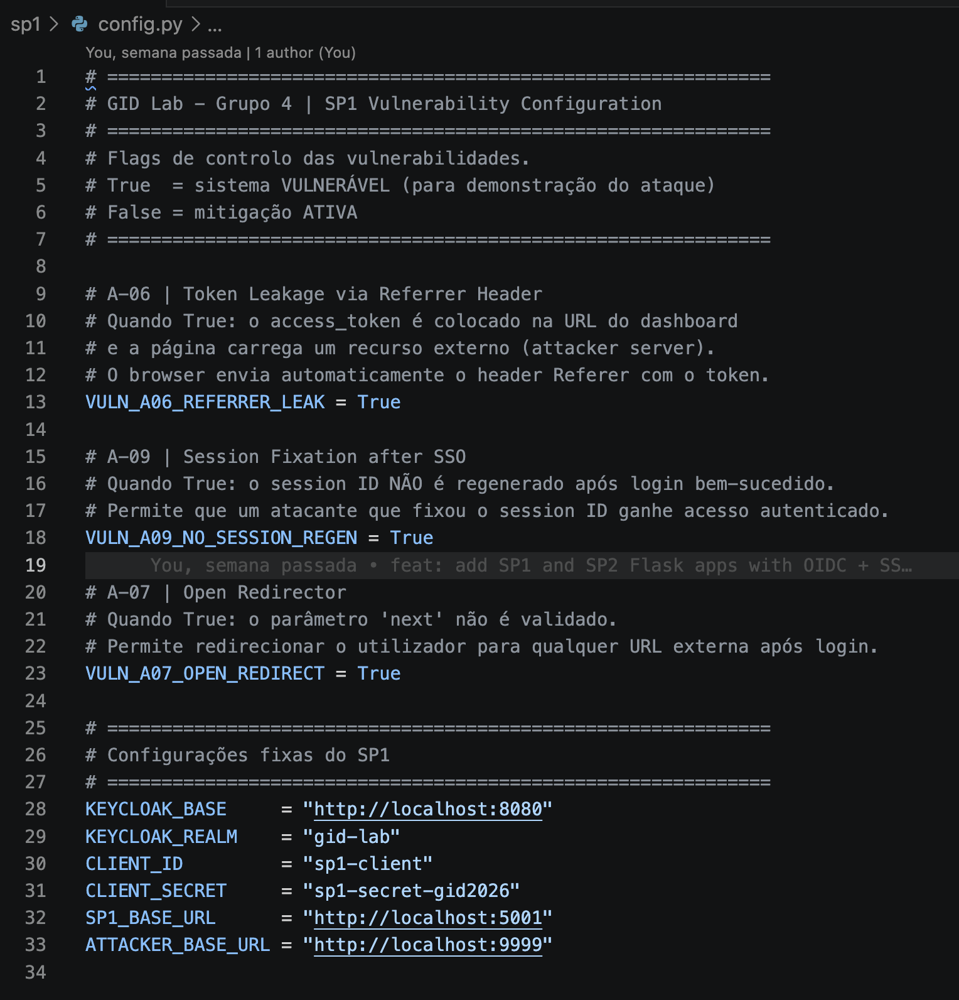
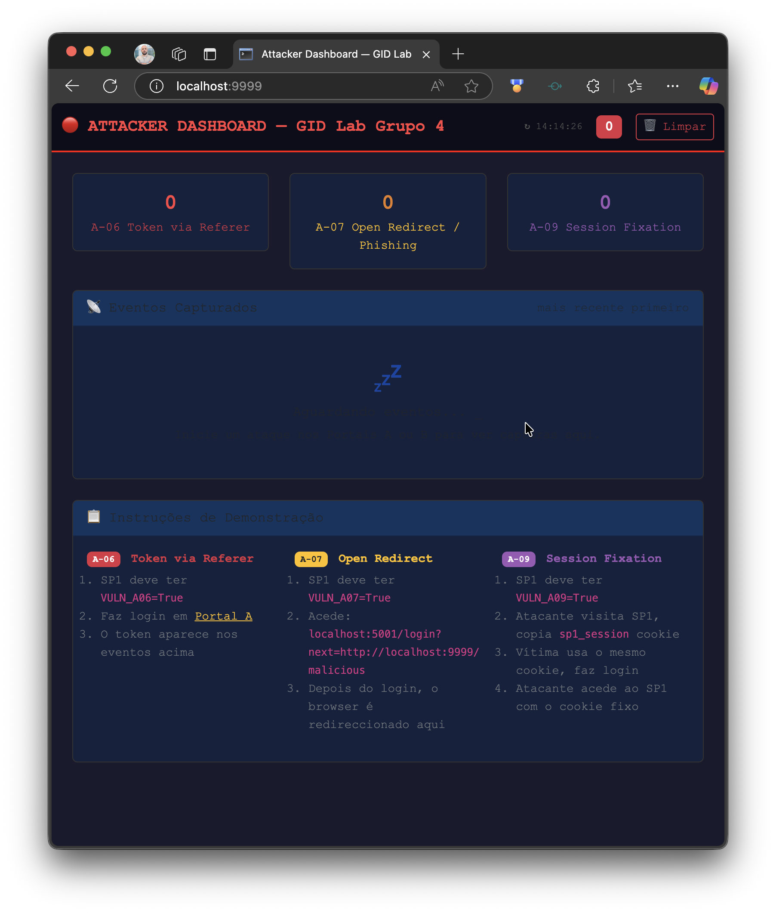
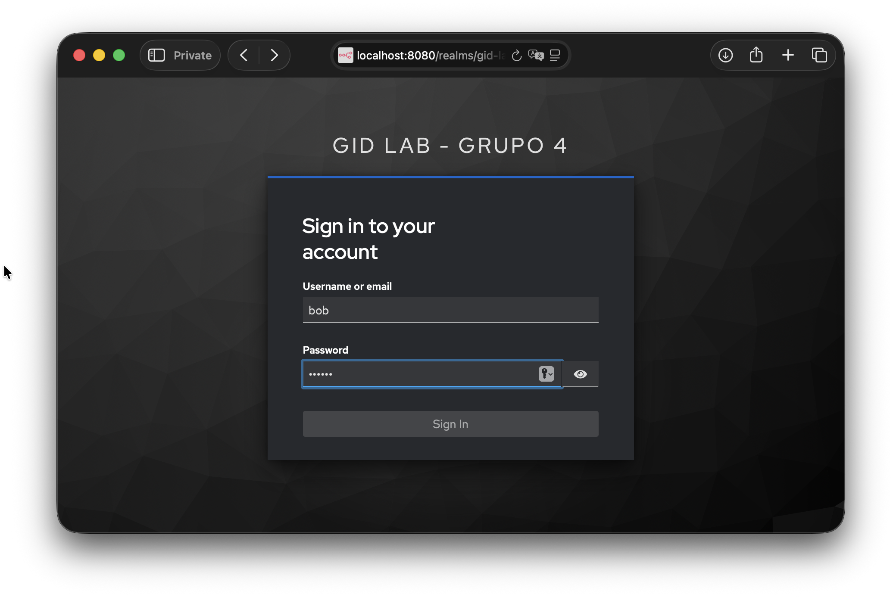
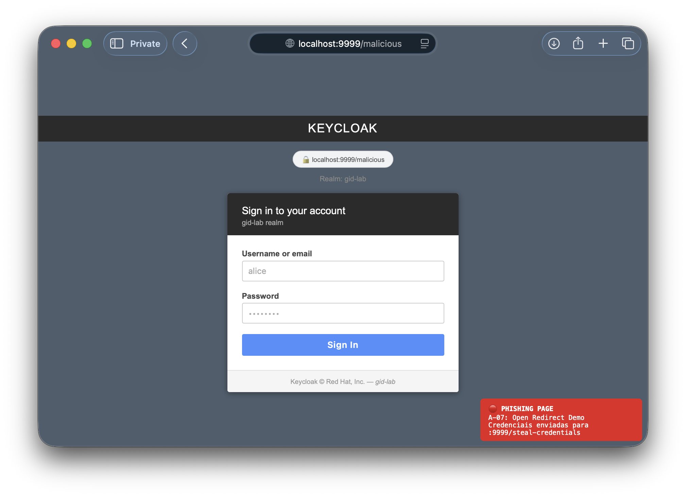
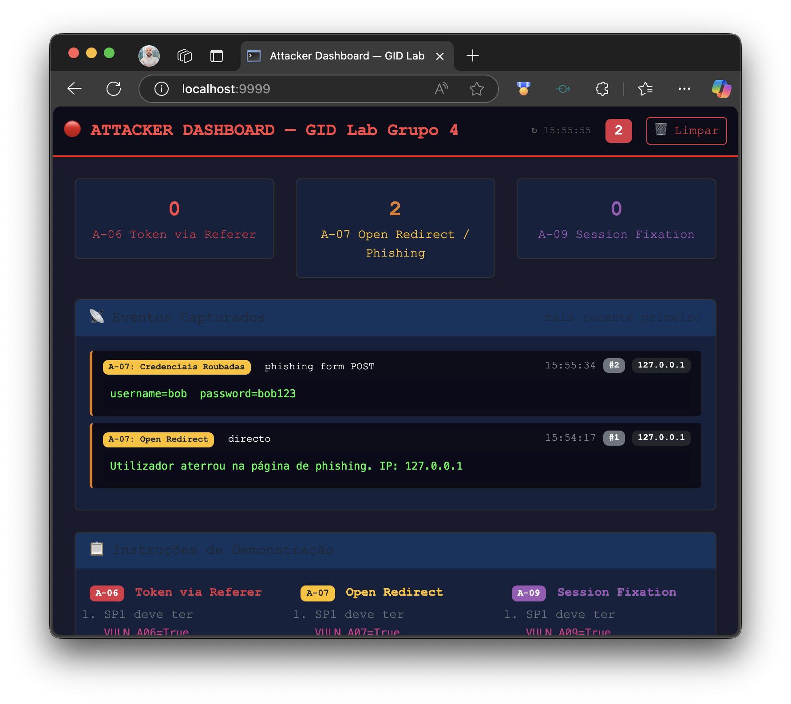
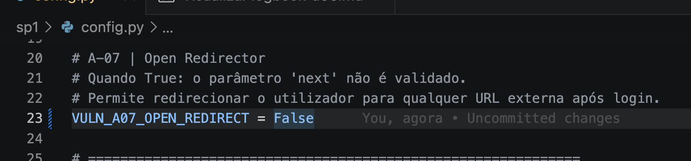
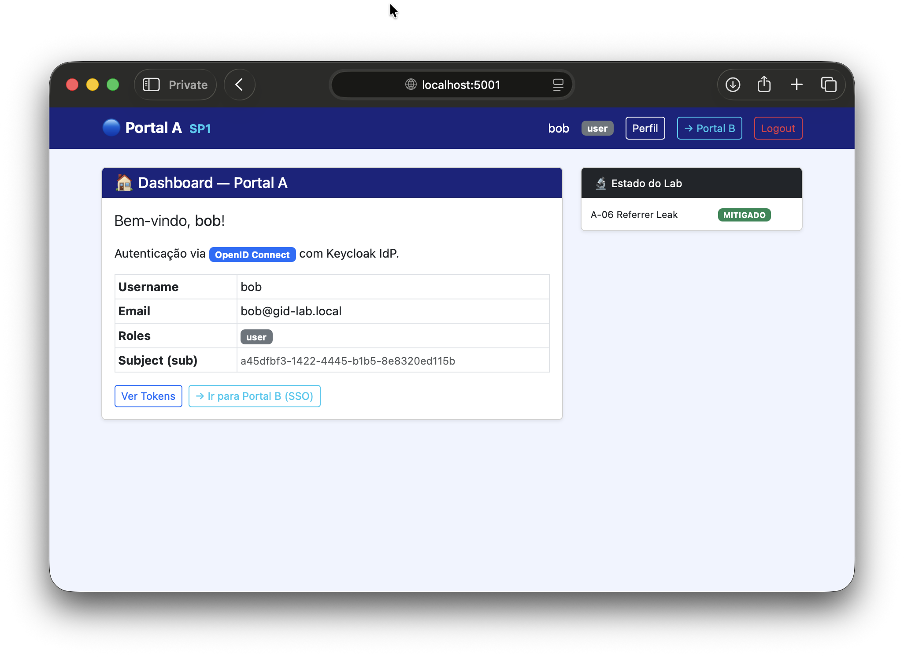

# Logbook — A-07: Open Redirector

**Grupo:** 4 — Mestrado em Cibersegurança, IPVC  
**Protocolo:** OpenID Connect (OIDC)  
**Stack:** Keycloak (IdP) + Flask SP1 (Service Provider)  
**Data:** 2026-04-10

---

## Ambiente

| Componente | URL | Descrição |
|------------|-----|-----------|
| Keycloak IdP | `http://localhost:8080` | Identity Provider |
| SP1 — Portal A | `http://localhost:5001` | Service Provider vulnerável |
| Attacker Server | `http://localhost:9999` | Servidor do atacante (phishing) |

---

## Fase 1 — Exploração da Vulnerabilidade

### 1.1 Configuração inicial (modo vulnerável)

Ficheiro `sp1/config.py` com todas as flags activas (igual ao estado inicial do lab):

```python
VULN_A06_REFERRER_LEAK    = True
VULN_A09_NO_SESSION_REGEN = True
VULN_A07_OPEN_REDIRECT    = True   # ← relevante para este ataque
```



> A imagem `a06-01-config-vuln.png` documenta o estado inicial comum às 3 vulnerabilidades.

### 1.2 Attacker Dashboard limpo — estado inicial

Antes do ataque, o dashboard foi limpo para garantir que apenas eventos
desta sessão de demonstração são registados.



### 1.3 URL maliciosa construída pelo atacante

O atacante constrói um link que usa o domínio legítimo do Portal A
mas inclui um parâmetro `?next=` apontando para o servidor de phishing:

```
http://localhost:5001/login?next=http://localhost:9999/malicious
```

Este URL é enviado à vítima (por email, mensagem, QR code, etc.).
Do ponto de vista da vítima, o link parece legítimo — começa com `localhost:5001`.

### 1.4 Login no Keycloak legítimo

O browser é redireccionado para o Keycloak real (`localhost:8080`).
A vítima vê uma página de login legítima e introduz as suas credenciais reais:

- **Username:** `bob`
- **Password:** `bob123`

O login é autêntico — o Keycloak processa as credenciais correctamente.
A vítima não tem razão para suspeitar nesta fase.



### 1.5 Redirect para página de phishing

Após autenticação bem-sucedida no Keycloak, o SP1 executa:

```python
next_url = session.pop("next_url", "")
# next_url = "http://localhost:9999/malicious"

if VULN_A07_OPEN_REDIRECT and next_url:
    return redirect(next_url)   # ← redirect para o atacante
```

O browser é enviado para `http://localhost:9999/malicious` — uma réplica
visual do Keycloak que pede login novamente, simulando uma falha de sessão.



### 1.6 Credenciais capturadas no Attacker Dashboard

Após submeter as credenciais na página de phishing, o Attacker Dashboard
regista dois eventos:

| Evento | Detalhe |
|--------|---------|
| `A-07: Open Redirect` | Utilizador aterrou em `/malicious` após autenticação |
| `A-07: Credenciais Roubadas` | `username=bob  password=bob123` capturados via POST |

As credenciais reais de `bob` foram capturadas sem qualquer interacção técnica —
apenas com um link malicioso enviado à vítima.



### 1.7 Redirect final para portal real

Após capturar as credenciais, o servidor do atacante redireccionou a vítima
de volta para `http://localhost:5001/` — o portal legítimo.

A vítima vê o dashboard normal e não tem razão para suspeitar que as suas
credenciais foram comprometidas durante o fluxo de login.

---

## Fase 2 — Mitigação

### 2.1 Configuração (modo mitigado)

Flag alterada em `sp1/config.py`:

```python
VULN_A06_REFERRER_LEAK    = True
VULN_A09_NO_SESSION_REGEN = True
VULN_A07_OPEN_REDIRECT    = False   # ← mitigação activa
```

SP1 reiniciado após a alteração.



### 2.2 O que muda no código com `False`

**`/login` — validação do parâmetro `next`:**

```python
if VULN_A07_OPEN_REDIRECT:
    session["next_url"] = next_url          # ← NÃO executado

else:
    # Só aceita paths internos (começam com / mas não com //)
    if next_url.startswith("/") and not next_url.startswith("//"):
        session["next_url"] = next_url      # "/profile" → aceite
    else:
        session["next_url"] = ""            # "http://..." → rejeitado
```

**`/callback` — redirect bloqueado:**

```python
next_url = session.pop("next_url", "")
# next_url = ""  (rejeitado na validação)

if VULN_A07_OPEN_REDIRECT and next_url:
    return redirect(next_url)   # ← NÃO executado

return redirect(url_for("index"))   # ← vai para o dashboard normal
```

---

## Fase 3 — Teste de Confirmação

### 3.1 URL maliciosa com mitigação activa

O mesmo link malicioso foi usado novamente com `VULN_A07_OPEN_REDIRECT = False`:

```
http://localhost:5001/login?next=http://localhost:9999/malicious
```

O SP1 recebe o parâmetro `next=http://localhost:9999/malicious` mas
a validação rejeita-o por ser uma URL absoluta externa:

```python
# next_url = "http://localhost:9999/malicious"
# não começa com "/" → rejeitado → session["next_url"] = ""
```

### 3.2 Utilizador vai para dashboard — Attacker Dashboard sem eventos

Com os dois browsers lado a lado:

- **Portal A** — após login, redireccionado directamente para o dashboard normal
- **Attacker Dashboard** — zero eventos registados, página de phishing nunca acedida

O parâmetro `?next=` foi silenciosamente ignorado e o utilizador
seguiu o fluxo normal de autenticação.



---

## Resultado

| Fase | Resultado |
|------|-----------|
| Exploração — redirect para phishing | ✅ Vítima enviada para `localhost:9999/malicious` |
| Exploração — credenciais capturadas | ✅ `username=bob password=bob123` registados |
| Exploração — vítima não suspeita | ✅ Redirect final para portal real |
| Mitigação aplicada (`VULN_A07 = False`) | ✅ |
| Confirmação — redirect bloqueado | ✅ Utilizador vai para dashboard normal |
| Confirmação — Attacker Dashboard vazio | ✅ Zero eventos registados |

**Conclusão:** A vulnerabilidade A-07 é mitigada validando o parâmetro `?next=`
na rota `/login` — apenas paths internos (que começam com `/`) são aceites.
URLs absolutas externas são silenciosamente descartadas.
