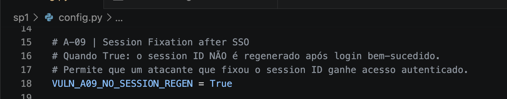
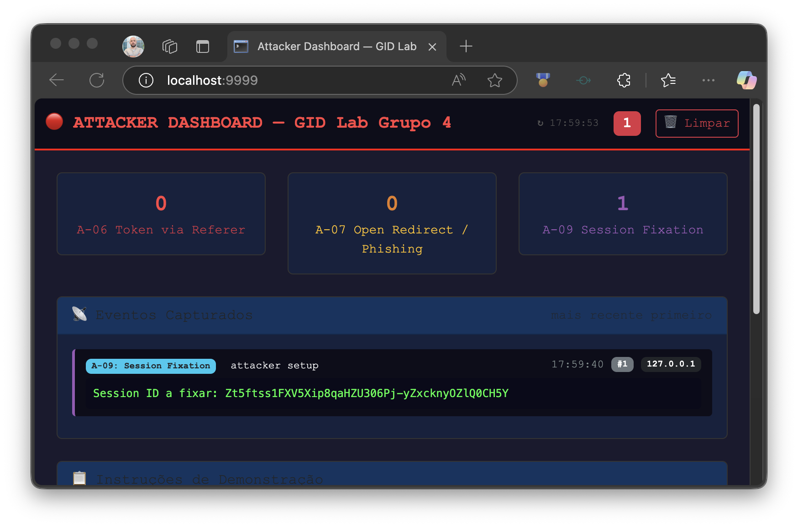
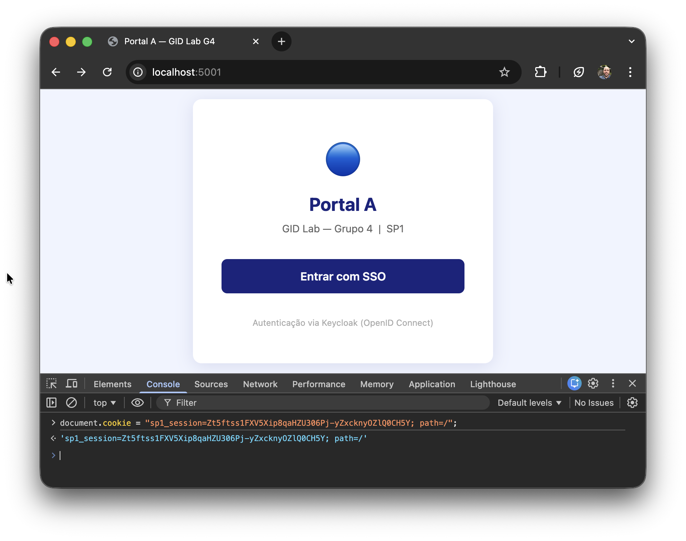
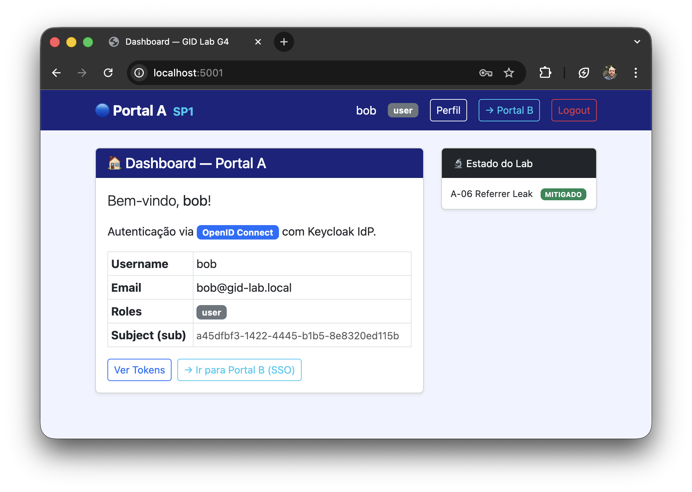
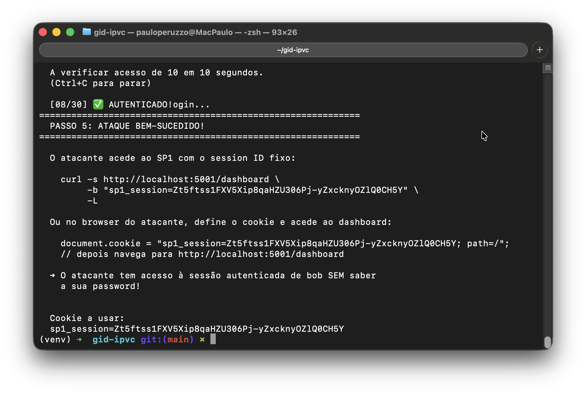
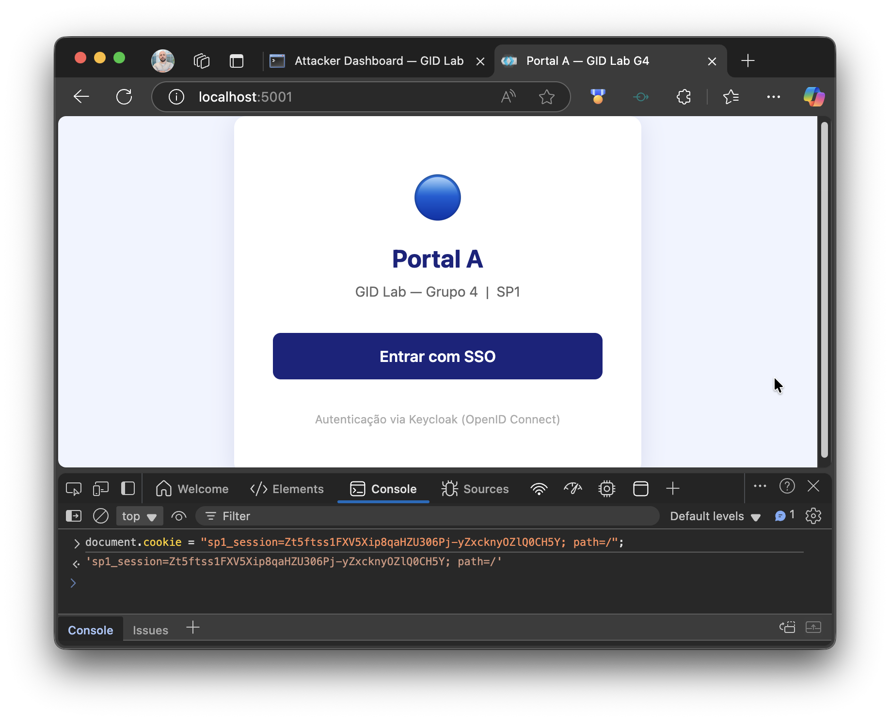
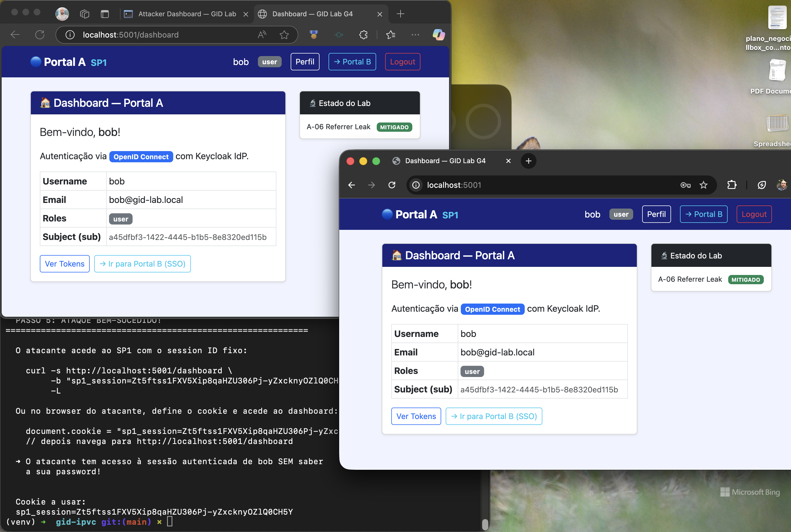
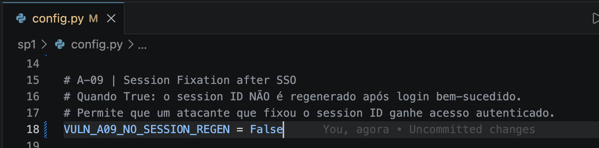
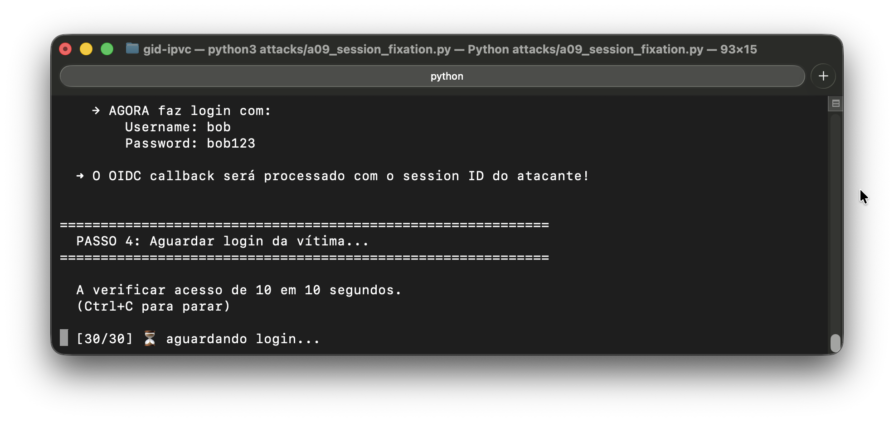
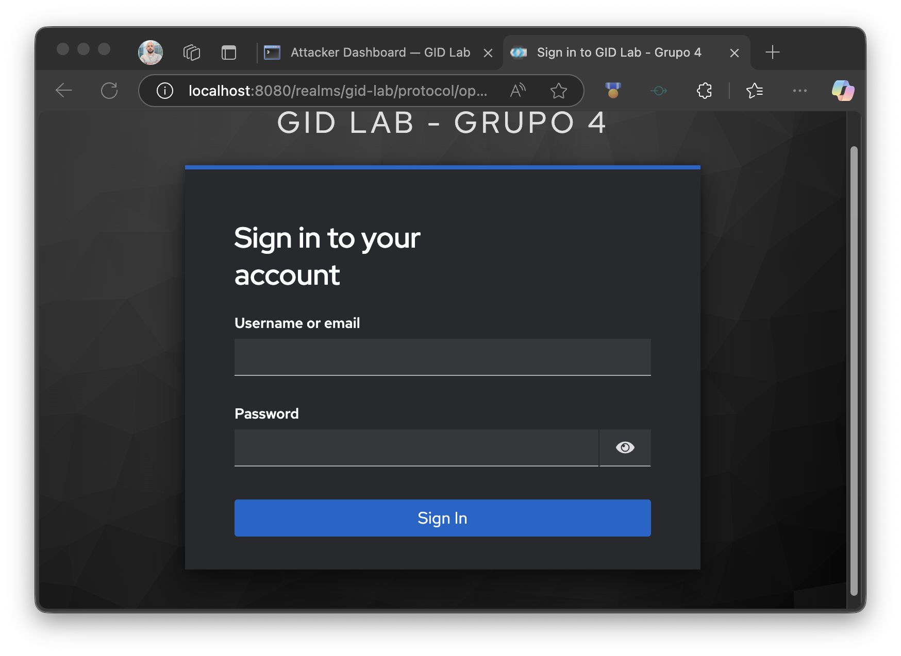

# Logbook — A-09: Session Fixation after SSO

**Grupo:** 4 — Mestrado em Cibersegurança, IPVC  
**Protocolo:** OpenID Connect (OIDC)  
**Stack:** Keycloak (IdP) + Flask SP1 (Session Server-Side)  
**Data:** 2026-04-10

---

## Ambiente

| Componente | URL | Descrição |
|------------|-----|-----------|
| Keycloak IdP | `http://localhost:8080` | Identity Provider |
| SP1 — Portal A | `http://localhost:5001` | Service Provider vulnerável |
| Attacker Server | `http://localhost:9999` | Servidor auxiliar do atacante |

---

## Fase 1 — Exploração da Vulnerabilidade

### 1.1 Configuração inicial (modo vulnerável)

Ficheiro `sp1/config.py` com a flag relevante activa:

```python
VULN_A06_REFERRER_LEAK    = False
VULN_A09_NO_SESSION_REGEN = True    # ← relevante para este ataque
VULN_A07_OPEN_REDIRECT    = False
```



### 1.2 Script de ataque iniciado — session ID obtido

O script `attacks/a09_session_fixation.py` visita o SP1 anonimamente,
captura o cookie `sp1_session` e limpa o estado OIDC da sessão no servidor:

```bash
python attacks/a09_session_fixation.py
```

```
============================================================
  PASSO 1: Atacante obtém session ID do SP1
============================================================

  Visitando http://localhost:5001/login sem completar o fluxo OIDC...

  ✅ Session ID obtido:
     sp1_session = <valor>

  A limpar estado OIDC da sessão no servidor...
  ✅ Estado OIDC removido da sessão
```

O script fica em espera activa (verificando de 10 em 10 segundos)
até que a vítima faça login com o cookie fixado.



### 1.3 Cookie injectado no browser da vítima

O session ID obtido pelo atacante foi injectado no browser da vítima
através do DevTools (F12 → Application → Cookies → http://localhost:5001):

1. Vítima abre `http://localhost:5001` — aparece a landing page do Portal A
2. Abre DevTools → **Application → Cookies → http://localhost:5001**
3. Duplo-clique no valor de `sp1_session` → substitui pelo valor do atacante

A partir deste momento, qualquer pedido do browser ao SP1 inclui
o session ID controlado pelo atacante — **antes de qualquer login**.



### 1.4 Vítima faz login com o cookie fixado

Com o cookie do atacante já activo no browser, a vítima clica
**"Entrar com SSO"** na landing page do Portal A:

1. Browser envia o cookie fixado ao SP1 → SP1 inicia fluxo OIDC na sessão do atacante
2. Keycloak apresenta a página de login legítima
3. Vítima autentica com `bob` / `bob123`
4. Keycloak redireciona para `/callback` — SP1 guarda os dados de bob
   **na sessão que o atacante controla** (sem regenerar o session ID)
5. Vítima fica no dashboard — não suspeita de nada



### 1.5 Script confirma acesso autenticado

Após o login da vítima, o script detecta que o session ID fixado
está agora autenticado e apresenta o PASSO 5:

```
============================================================
  PASSO 5: ATAQUE BEM-SUCEDIDO!
============================================================

  O atacante acede ao SP1 com o session ID fixo:

    curl -s http://localhost:5001/dashboard \
         -b "sp1_session=<valor>" \
         -L

  ➜ O atacante tem acesso à sessão autenticada de bob SEM saber
    a sua password!
```



### 1.6 Atacante acede ao dashboard da vítima

Com o session ID fixado confirmado pelo script, o atacante abre o seu
próprio browser e define o cookie manualmente via DevTools
(F12 → Application → Cookies → http://localhost:5001):



Após definir o cookie, o atacante navega para `http://localhost:5001/dashboard`
e acede ao portal autenticado como **bob** — sem nunca ter introduzido
as credenciais da vítima:



---

## Fase 2 — Mitigação

### 2.1 Configuração (modo mitigado)

Flag alterada em `sp1/config.py`:

```python
VULN_A06_REFERRER_LEAK    = False
VULN_A09_NO_SESSION_REGEN = False   # ← mitigação activa
VULN_A07_OPEN_REDIRECT    = False
```

SP1 reiniciado após a alteração.



### 2.2 Código da mitigação — regeneração do session ID após login

`session.clear()` sozinho **não é suficiente**: limpa os dados mas mantém
o mesmo session ID, pelo que o cookie do atacante continuaria válido.

A mitigação correcta gera explicitamente um novo `sid` antes de escrever
os dados do utilizador autenticado:

```python
# ---- A-09: Session Fixation ----
if VULN_A09_NO_SESSION_REGEN:
    pass  # VULN: mantém o session ID do atacante
else:
    # MITIGAÇÃO: session.clear() sozinho não chega — mantém o mesmo ID.
    # É necessário gerar um novo SID e abandonar o antigo.
    import secrets
    session.clear()
    session.sid = secrets.token_urlsafe(32)

# Escreve os dados do utilizador no novo session ID
session["user"]         = user_info
session["access_token"] = token.get("access_token")
```

Após o login da vítima, o SP1 emite um **novo** cookie `sp1_session`
com um ID aleatório. O ID que o atacante fixou torna-se um ficheiro
de sessão vazio — qualquer acesso com ele é redireccionado para login.


---

## Fase 3 — Teste de Confirmação

### 3.1 Script deteta que o session ID foi substituído

O mesmo ataque foi repetido com `VULN_A09_NO_SESSION_REGEN = False`.

A vítima fez login com sucesso como `bob` — mas o SP1 gerou um **novo**
session ID no momento do callback, descartando o ID fixado pelo atacante.

O script continuou em espera activa e esgotou o tempo sem detectar
acesso autenticado, confirmando que o ID fixado ficou inútil:

```
============================================================
  PASSO 4: Aguardar login da vítima...
============================================================

  A verificar acesso de 10 em 10 segundos.
  (Ctrl+C para parar)

  [30/30] ⏳ aguardando login...

  [TIMEOUT] A vítima não fez login em 300s.
  O session ID ainda é: <valor fixado pelo atacante>
```



### 3.2 Atacante tenta aceder com ID antigo — redirect para login

Com o cookie fixado ainda definido no browser do atacante, a tentativa
de aceder a `http://localhost:5001/dashboard` resulta em redirect para
a landing page — a sessão com o ID antigo não tem dados de utilizador.



---

---

## Resultado

| Fase | Resultado |
|------|-----------|
| Exploração — session ID fixado no browser da vítima | ✅ Cookie injectado via DevTools |
| Exploração — vítima faz login com ID do atacante | ✅ SP1 autentica bob na sessão do atacante |
| Exploração — atacante acede ao dashboard de bob | ✅ Acesso sem conhecer a password |
| Mitigação aplicada (`VULN_A09_NO_SESSION_REGEN = False`) | ✅ |
| Confirmação — script em timeout após login da vítima | ✅ ID fixado não ficou autenticado |
| Confirmação — acesso com ID antigo redireccionado | ✅ Landing page — não autenticado |

**Conclusão:** A vulnerabilidade A-09 é mitigada pela regeneração explícita
do session ID após autenticação bem-sucedida. `session.clear()` sozinho
não é suficiente — é necessário atribuir um novo `session.sid` para que
o Flask-Session emita um cookie diferente, tornando o ID fixado pelo
atacante completamente inútil.
